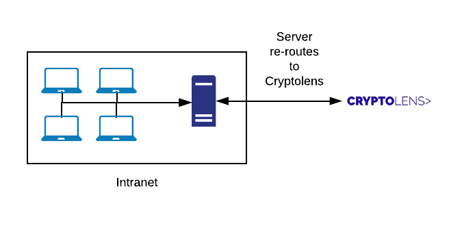

# License Server

## Idea
**Problem**: Large companies tend to have strict policies that restrict certain machines to have direct internet access. This is a problem if we want license files on them to be up-to-date.

**Solution**: We allow one computer, the *license server*, to have internet access. All the machines in the network will contact the license server and it will in turn contact Cryptolens.



## Starting the server

In order to launch the server, you need to run `LicenseServer.exe` as an administrator. The default port is 8080 but this can be changed.
One way of doing it is to run CMD as an administrator and then type the command below:

```
C:\> LicenseServer.exe 5000
```
> Please make sure to check that this port is open so that other computers in the network can access it (shown below).

## Allowing ports

In order to allow other computers in the network to access the license server, you need to open up the desired port in the firewall. 
If you use the default firewall, it can be opened as follows:

1. Run `wf.msc`
2. Right click on **Inbound Rules** and then click on **Add Rule**
3. Ryle type should be **Port**
4. **Specific local ports** should be checked, and the textbox at the right of it should be set to 5000 (or any other port of your choosing).
5. Click next through the entire wizzard and that should be it.
